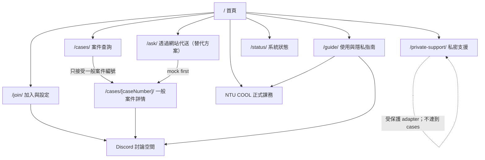
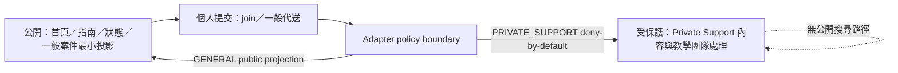

# Portal information architecture

## 核心原則

1. 首頁先回答「我現在能做什麼」，案件編號查詢必須在第一個主內容區塊中看見。
2. 直接在 Discord 發問是主要可用路徑；「透過網站代送」清楚標示為替代方案，不是必經流程。
3. NTU COOL 是教材、作業、成績、期限、正式公告與課程政策的唯一正式依據；相關頁面都提供回到 NTU COOL 的明顯位置。
4. 作者顯示方式、內容可見範圍與 analysis permission 分開說明。
5. Private Support 是獨立入口與受保護流程，不是公開案件查詢的一種結果。

## Route map

Private Support 沒有到 `/cases/` 或 `/cases/[caseNumber]/` 的資料流。公開查詢對不存在與不公開案件使用相同的最小揭露策略，不確認某個私密案件是否存在。

## Navigation hierarchy

### Global header

- 首頁
- 加入與設定
- 提問（下拉／群組）
  - 前往 Discord 發問
  - 透過網站代送（替代方案）
  - Private Support（獨立且附保護提示）
- 使用與隱私指南
- 系統狀態

案件查詢在首頁主區塊中比導覽列更顯著；header 可另提供短連結「查案件」。

### Global footer

- 「正式課務請以 NTU COOL 為準」與外部連結位置。
- Discord 使用指南與隱私提醒。
- 系統狀態、資料與同意說明。
- 原型標示：fixture mode／未連正式服務。

## Page ownership and runtime needs

| Route | 頁面負責 | 明確不負責 | 公開性 | 實作型態 |
|---|---|---|---|---|
| `/` | 首要動作、顯著 case search、NTU COOL 權威提示、三種求助入口 | 顯示完整案件內容、收集敏感資料 | Public | 靜態 shell + CaseLookup adapter |
| `/cases/` | 正規化輸入、查詢狀態、not-found／malformed 指引 | 列出所有案件、搜尋 Private Support、持續 polling | Public | 靜態 shell + CaseLookup adapter |
| `/cases/[caseNumber]/` | 一般案件最小公開內容、狀態、更新、conversation、明確 refresh | 內部 ID、Discord snowflake、Private Support、管理操作 | Public (GENERAL only) | fixture 預產；正式版按需 adapter |
| `/join/` | Discord connection placeholder、email/class/setup、隱私與暱稱限制 | 證明 OAuth=course membership、正式寄信或加入 server | Public form shell；提交後屬個人流程 | 靜態 + mock onboarding adapter |
| `/ask/` | 一般問題代送替代路徑、顯示／可見／分析選項 | 取代 Discord 或 NTU COOL、處理 Private Support | Public form shell；提交內容非公開 | 靜態 + mock submission adapter |
| `/private-support/` | 保護警告、教學團隊可見性、分析排除、受保護提交 | 產生可公開查詢編號、出現在公開 conversation | Public entry；內容 private | 靜態 + restricted mock adapter |
| `/guide/` | 平台邊界、匿名限制、DM 建議、同意、直接 Discord 與網站代送比較 | 承諾完全不可識別、正式政策核准 | Public | Static |
| `/status/` | fixture/backend/service 可用性、最後人工更新、fallback | 暴露內部監控或 secrets、宣稱 SLA | Public | Static fixture；未來 status adapter |
| `/components/` | 開發用元件 gallery | 正式學生流程 | Local/development | Static fixture |
| `/404.html` | 找不到頁面、回首頁／查詢／指南 | 猜測案件是否存在 | Public | Static |

## Public/private boundary

- 公開 case detail 只使用 CaseLookupResponse／經允許的 conversation projection，不直接序列化完整 Case。
- 表單不把個資寫入 localStorage/sessionStorage；未送出前只存在當前 DOM memory。
- Private Support 可由公開頁面看到「入口與保護說明」，但其內容、狀態與存在性不可由公共 case search 得知。

## External return points

- 首頁「查看教材、作業、期限與正式公告」→ NTU COOL。
- `/guide/` 每個「課務正式依據」段落 → NTU COOL。
- 首頁與 `/ask/` 的「直接在 Discord 發問」→ Discord forum（正式 URL 未設定前顯示 mock/disabled link）。
- `/join/` 完成頁 → Discord setup/join placeholder；不可暗示已加入。
- 一般案件詳情「在 Discord 查看討論」→ placeholder，且 UI 不呈現原始 thread ID。
- Discord 或 Portal 故障時，課務問題回 NTU COOL；不自行捏造教職員 email。

## Rendering and adapter matrix

- **完全靜態**：guide、404、基礎 status、所有平台邊界文字。
- **靜態 + fixture adapter**：home search、cases search/detail、join、ask、private-support、component gallery。
- **未來需受控 backend adapter**：真正的 email verification、OAuth callback、一般問題提交、Private Support 提交、單筆 case lookup、系統狀態。
- **永不放在 client 的能力**：bot token、OAuth secret、activation nonce verifier、Sheets credentials、Private Support storage query。
