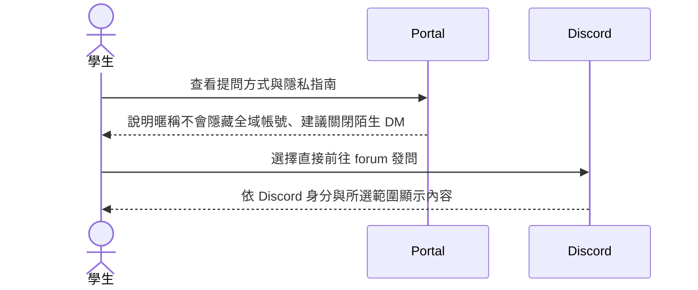
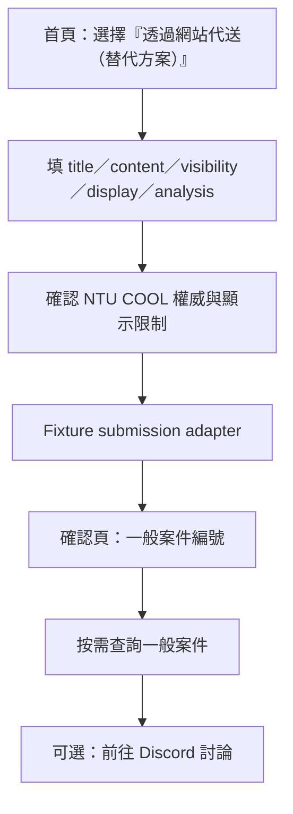
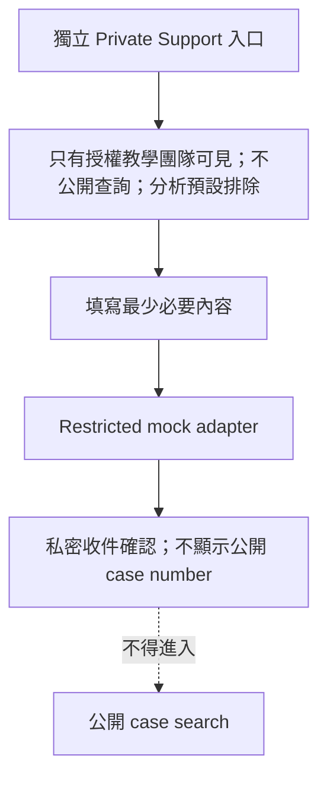
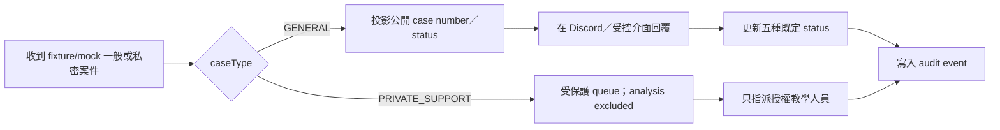

# Portal user journeys

## 學生：直接在 Discord 發問

網站不要求學生先填表，也不聲稱能替 Discord 上的普通發文完全匿名。

## 學生：透過網站代送一般問題（替代方案）

完全匿名 follow-up 必須繼續使用網站或 Discord modal 讓 bot 代貼，不能直接在 thread 以本人帳號回覆。

## 學生：一般案件查詢

1. 在首頁第一主區塊輸入 `C01-7K4M2Q-0702-1000`；前後空白與大小寫可正規化。
2. malformed：就地顯示格式範例，不送 request。
3. found：前往／呈現一般案件詳情，顯示狀態、更新時間、可見範圍與允許公開的對話。
4. not found / not public：顯示相同的「找不到可公開案件」文字，不揭露 Private Support 是否存在。
5. 使用者可按「重新整理此案件」明確觸發單筆 lookup；沒有 timer 或背景 polling。

## 學生：Private Support

## 學生：加入、設定與隱私引導

1. 先讀「Discord connection 不等於課程身分」與 `nnmmm` 限制。
2. Discord connection 僅顯示 placeholder；填 NTU email、選填 contact Gmail、班別、規則／隱私確認與 analysis default。
3. 預覽 course alias 只用 fixture joining order，不宣稱已保留或正式指派。
4. 完成頁重申：全域 username/display/avatar 仍可見，建議停用 shared-server member unsolicited DMs。
5. 回到 Discord join placeholder 或 `/guide/`；課務資訊回 NTU COOL。

## 學生：先讀隱私指南再決定

- 比較直接 Discord 與網站代送的身分顯示差異。
- 分別選擇 author display、visibility、analysis permission。
- 看到 Private Support 與「一般匿名」不同。
- 若不接受目前原型限制，可不提交，返回 NTU COOL／Discord 指南；沒有強迫 onboarding。

## 教學團隊：案件 triage

Portal 第一版不提供完整管理 dashboard；triage journey 先定義 adapter 與內容需求，正式管理介面由 GAS/Discord lane 驗證。

## Failure and fallback journeys

| 情境 | 使用者訊息 | 可採動作 | 不可採動作 |
|---|---|---|---|
| Case number malformed | 「格式似乎不完整，請參考 C01-7K4M2Q-0702-1000」 | 保留輸入、移焦到錯誤摘要後可修改 | 發送無效 request、責怪使用者 |
| Case not found / not public | 「找不到可公開的一般案件」 | 重試、回首頁、閱讀指南 | 確認 Private Support 存在、列出相似案件 |
| Lookup adapter unavailable | 「目前無法取得案件；資料沒有遺失的保證」 | 明確重試、看 status、稍後再試 | 自動連續 polling、顯示 stale 為最新 |
| Discord unavailable | 「Discord 目前可能無法使用」 | 網站代送 mock／稍後重試；正式課務回 NTU COOL | 把網站說成正式課務替代品 |
| Form validation fail | 就地具體提示並保留非敏感欄位 | 修改、取消、讀說明 | 清空整張表、儲存到 localStorage |
| Mock submission | 「這是原型確認，沒有送出或寄信」 | 返回、查看 fixture receipt | 暗示真實 Discord/email/Sheet 已寫入 |
| JavaScript disabled | 顯示靜態平台邊界與連結 | 前往指南、NTU COOL、Discord placeholder | 宣稱互動表單可用 |
| 404 | 「找不到此頁，不代表案件不存在」 | 首頁、案件查詢、指南 | 以 URL 推測私密案件 |
