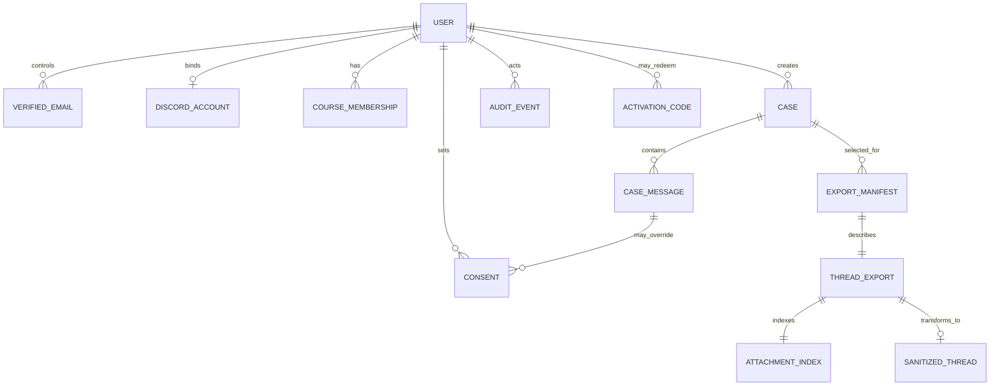

# 資料模型概觀

## 契約原則

`contracts/schemas/` 使用 JSON Schema Draft 2020-12，目前跨元件 `schemaVersion` 為 `1.0`。資料模型是 Portal、GAS、bots 與 local tools 的交換邊界，不是將各 framework runtime object 直接序列化。所有 fixtures 皆為人工設計的虛構資料。

## 核心關係



## 主要 record

| Record             | 用途                                             | 重要邊界                                                                     |
| ------------------ | ------------------------------------------------ | ---------------------------------------------------------------------------- |
| `User`             | 內部使用者關聯點                                 | 不將顯示名作為關聯主鍵                                                       |
| `VerifiedEmail`    | 信箱控制驗證                                     | 機構信箱、聯絡信箱與課程 membership 不可混同                                 |
| `DiscordAccount`   | Discord OAuth/binding 狀態                       | OAuth 不等於課程資格證明                                                     |
| `CourseMembership` | 班別、狀態、`nnmmm` course alias                 | alias 不隱藏 Discord 全域 profile                                            |
| `Case`             | 一個可追蹤的提問/求助                            | status 只有 `OPEN`、`WAITING_FOR_STUDENT`、`ANSWERED`、`ESCALATED`、`CLOSED` |
| `CaseIdMapping`    | public case number 與 internal UUID 的受保護映射 | 不得出現在 public projection；兩欄皆須 unique                                |
| `CaseMessage`      | 案件中的單則訊息                                 | 保留 timezone、edit、parent reply、source 與 attachment metadata             |
| `Consent`          | account default 或 per-message analysis override | 不等於公開、模型訓練或自動評分同意                                           |
| `ActivationCode`   | 單次、限時、可稽核的例外啟用 nonce               | 儲存 verifier/hash，不儲存或回傳明文                                         |
| `ExportManifest`   | 一次明確 dump/follow 的索引與 hashes             | Private Support 內容預設不得匯出                                             |
| `AuditEvent`       | 最少必要事件紀錄                                 | 不得以 arbitrary metadata 儲存內容/secrets                                   |
| `ThreadExport`     | Task 26 raw selected-thread package              | 含 internal/Discord IDs，只限 Git-ignored authorized local area              |
| `AttachmentIndex`  | 附件 metadata 索引                               | 不包 CDN URL，不下載 binary                                                  |
| `SanitizedThread`  | 同意過濾與 case-local pseudonym package          | 不宣稱不可逆匿名，必須人工複核                                               |

## 案件的三個正交維度

1. **作者顯示方式**：`REAL_NAME`、`COURSE_ALIAS`、`ANONYMOUS`。
2. **可見範圍**：`CLASS`、`COURSE`、`TEACHING_STAFF`。
3. **教學分析同意**：`INCLUDED`、`EXCLUDED`、message-level `INHERIT`。

三者分別回答「顯示誰」、「誰看得到」與「能否進入後續教學品質檢視」，不能用單一 `anonymous` 布林值代替。

## General 與 Private Support

- General case 可有人可讀 `Cxx-<random>-MMDD-HHMM` case number 與 Discord thread mapping，但公開顯示仍必須經 `CaseLookupResponse` allowlist 投影。
- Private Support 使用 `-P` 尾碼的受保護 case number，並強制 `visibility=TEACHING_STAFF`、`analysisPermission=EXCLUDED`；它仍不得出現在 public lookup，export policy 也維持 fail closed。
- 六字元 random token 不可從姓名、學號、Email、Discord ID 或 internal UUID 推導；`C99` 代表非標準班級／特殊身份。

## Raw 到 sanitized 的變換

```text
selected fixture/live thread
  -> raw thread.json + metadata.json + attachments.json
  -> case/message consent decision
  -> local message refs + role pseudonyms + redaction markers/placeholders
  -> sanitized-thread.json + consent summary + redaction log + review checklist
  -> optional dry-run/CSV/mock batch import
```

Raw 與 sanitized 必須存放在不重疊的 Git-ignored 目錄。批次匯入只取 sanitized messages/summaries 與必要 export metadata，不傳 raw attachment bytes、URL 或 internal Discord/user IDs。

字段細節見 `contracts/schemas/*.schema.json`；虛構關聯值與筆數見 `fixtures/DATA_DICTIONARY.md`。
