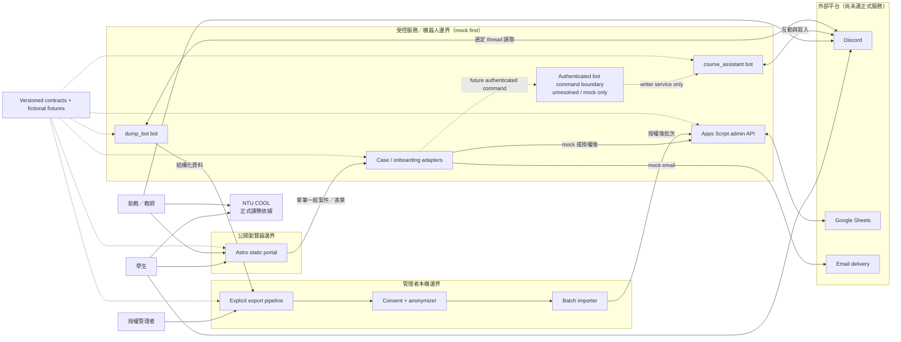

# 系統脈絡與信任邊界

下圖是第一版原型的責任與資料流，不是已核准的正式部署圖。實線表示預期互動；標示 `mock first` 的外部介接在本地與 CI 使用 fixtures/adapters。

## 安全讀法

- 瀏覽器只取得公開設定與最小化 API response；圖中沒有、實作也不得加入瀏覽器到 bot token 的路徑。
- 每個 bot token 只由該 bot 的 runtime environment 注入；`course_assistant` 與 `dump_bot` 不共用 token。
- `course_assistant`是interaction/write唯一owner；`dump_bot`只有explicit selected-thread read，沒有send/role/nickname能力。
- `commandApi`是Task 32前的未決/mock boundary，不表示Portal或GAS已能直連Discord。Browser→Discord REST永遠禁止。
- Private Support 經獨立 policy 投影，公開 Portal query 不得碰觸其內容。
- 原始匯出只存在授權管理者的 Git-ignored 本機資料區；匿名化與同意判定先於分析／批次匯入。
- NTU COOL 與本系統沒有自動同步；它仍是正式課務來源。
