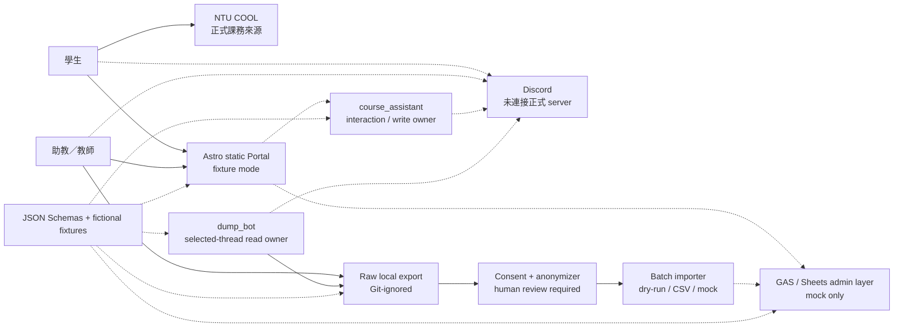

# 架構概觀

## 文件定位

這是 fixture-first prototype 的審查版架構摘要，不是已核准的 production deployment diagram。正式外部依賴仍保持為 mock、adapter boundary 或 fail-closed stub。

## 一條可審查的資料路徑

實線代表本儲存庫可以用 fixtures 實際執行與測試的邏輯；點線代表正式 transport 或平台仍未連接。Browser 永遠不得持有 bot token。

## 元件與信任邊界

1. **公開瀏覽器邊界**：Portal 只能取得 allowlisted 的一般案件投影。目前 build 內的資料是虛構 fixtures；正式案件不可被打包進 public JavaScript。
2. **受控服務邊界**：GAS、case adapters 與 bots 在後端執行 validation、visibility 與 identity policy。目前 cloud/Web App/AuthN/AuthZ/CORS 未配置。
3. **Discord 應用邊界**：`course_assistant` 是 interaction/write owner；`dump_bot` 只讀取管理者明確選定的 thread。不共用 token，不使用一個高權限 bot 代替所有角色。
4. **管理者本機邊界**：raw export 保留 internal/Discord IDs 與被排除內容，只能放在 Git-ignored local area。送往任何分析或批次匯入前，須先通過同意判定、去識別化與人工 review checklist。
5. **Private Support 邊界**：使用受保護的 `-P` 案號、`TEACHING_STAFF` visibility、`EXCLUDED` analysis permission；該案號不是存取憑證，一般 lookup 與內容匯出均 deny by default。

## 為何是 Astro？

Portal 使用 **Astro + TypeScript static output**。Astro 是目前實際的 framework 與 build system，負責 routes、layouts、components、base-path-safe links 與 static artifact。第一版使用 plain CSS design tokens，以降低框架耦合並保留無 JavaScript 時的關鍵說明。

後續若需視覺改版，外部或自製 **templates 只是可選視覺起點**；必須適配既有 information architecture、accessibility、privacy copy 與 Astro components，不是取代架構、契約或安全邊界的方案。

## 關鍵交換契約

- `Case` / `CaseLookupResponse`：內部案件與 public allowlist 投影分離。
- `CaseMessage`：保留 source、timezone timestamp、edit、reply 與 attachment metadata。
- `ExportManifest` / `ThreadExport`：管理者明確啟動的 raw dump/follow 記錄。
- `SanitizedThread`：同意過濾、case-local pseudonyms 與 structural placeholders；仍需人工複核。
- `AuditEvent`：只記必要的動作、結果與時間，不用任意 metadata 收藏敏感內容。

詳細圖與元件表見 [CONTEXT.md](CONTEXT.md) 與 [COMPONENTS.md](COMPONENTS.md)；架構決策見 [ADR 索引](../decisions/README.md)。
