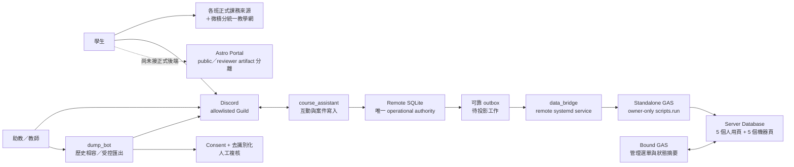

# 架構概觀

## 文件定位

本圖描述 2026-08-24 已整合的架構與仍受 gate 限制的部分。它不是正式課程服務核准文件。最新執行狀態以 [實作狀態](../IMPLEMENTATION_STATUS.md) 為準。

## 現行資料路徑

Remote Linux 上的 `course_assistant`、`dump_bot` 與 `data_bridge` 是 production systemd services；Mac writers 已停止。SQLite 的案件異動與 outbox 在同一個 transaction 寫入；Google 暫時不可用時，Discord 不必停寫。Standalone GAS 只接受 owner 的 Apps Script Execution API 呼叫，不提供公開 Web App endpoint。

已驗證 production baseline 是 schema v6，其 24 小時 observation 已於 2026-08-24 17:16 PASS；repository v13 deployment candidate 已整合到 schema v13，但尚未部署。Portal 的公開資訊可靜態輸出；加入申請與案件查詢 backend 未接線時一律 fail closed。

## 元件與信任邊界

1. **正式課務邊界**：教材、成績、期限與政策以各班正式公告為準；微積分統一教學網提供共通資訊。Discord 與 Portal 只能補充教學互動。
2. **Discord 寫入邊界**：`course_assistant` 負責案件與互動寫入；`dump_bot` 只讀取管理者明確指定的範圍。兩隻 bot 不共用 token 或權限角色。
3. **資料邊界**：Remote SQLite 是案件狀態的唯一權威來源。Sheet 是精簡投影，不能在沒有版本、checksum、來源與人工確認時反向覆寫 SQLite。
4. **Google 邊界**：Standalone GAS 採 `executionApi.access=MYSELF`。OAuth 憑證只存於 Git-ignored、權限 `0600` 的本機目錄；GAS、Sheet 與報告不保存 client secret 或 refresh token。
5. **瀏覽器邊界**：public artifact 不含內部路由或 fixture。未完成 authenticated／same-origin backend、rate limit 與 Private Support 最小揭露前，不得啟用動態 submission／lookup。
6. **分析與匯出邊界**：raw Discord 匯出只能留在受保護本機區。送往任何 AI 或分析流程前，必須通過逐案同意判定、去識別化與人工 release gate；Private Support 不會因為保存了選擇就自動匯出。

## 為何保留 Astro Portal

Portal 使用 Astro、TypeScript 與 static output。它負責學生可閱讀的加入說明、隱私引導與查詢入口，不承擔 bot token、SQLite writer 或 Google owner authority。reviewer build 可保留 fixture／內部頁作 QA；public build 會移除它們，且不把 `scripts.run` 暴露給瀏覽器。

## 關鍵交換契約

- `Case`／`CaseLookupResponse`：內部案件與公開 allowlist 投影分離。
- Production SQLite migration v6：durable Discord lifecycle、service health、projection stream 與可靠 outbox。
- Repository candidate migrations v7–v13：Portal case runtime、Course Manager join review、持久 nickname allocation、Private 共用標籤、email challenge 與人工接管；尚未部署。
- `ProjectionEnvelope`：Bridge 的 preview／apply 契約，包含 schema 版本、來源與 checksum。
- `ExportManifest`／`ThreadExport`：管理者明確啟動的受控 dump／follow 紀錄。
- `SanitizedThread`：同意過濾、case-local pseudonym 與結構化 placeholder；仍須人工複核。
- `AuditEvent`：只記必要動作、結果與時間，不以任意 metadata 收藏敏感內容。

詳細元件表見 [CONTEXT.md](CONTEXT.md) 與 [COMPONENTS.md](COMPONENTS.md)；部署與 cutover 規則見 [production integration plan](PRODUCTION_INTEGRATION_PLAN.md) 與 [live cutover runbook](../ops/LIVE_CUTOVER_RUNBOOK.md)。
