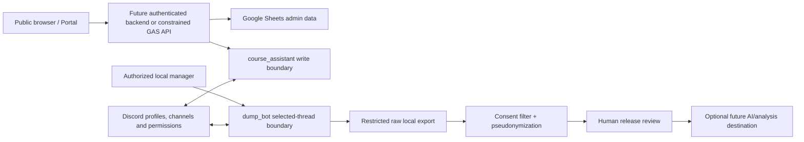

# 安全、隱私與濫用威脅模型

- Review date: 2026-07-23
- Scope: 目前的 fixture-first 本機原型
- Owners: 教學團隊、隱私負責人、系統維護者
- Related ADRs: ADR-0002、ADR-0004、ADR-0006–0012

> 這是 2026-07-23 的原型期基線，不是目前部署清單。Discord 測試 Guild、Mac bots、精簡 Sheet、owner-only Execution API 與 Desktop OAuth 的後續狀態見 [`docs/IMPLEMENTATION_STATUS.md`](../IMPLEMENTATION_STATUS.md)。本文的未解風險仍可作正式試用 gate；「目前沒有外部連線」等歷史敘述不可再當成現況。

> 2026-08-28 post-v13 override：F-03、F-10、F-11 與 F-15 的原始建議不得再被當成
> 現行產品決策。Owner 已接受完整 Case ID 作 content-free 單案狀態查詢的 bearer capability，
> 不要求 user ID／OAuth；一般與 Private 共用最小 projection。Local candidate 已加入匿名分
> scope session、CSRF、same-origin／Host allowlist、session／IP／global rate limit、generic error、
> metadata-only audit 與不將 Case ID 寫入 URL 的 POST 流程。剩餘 gate 是 external staging、
> production service／SQLite／audit 接線與 live abuse／白帳號驗收。若未來增加案件內容或操作，
> 才重新要求 identity 與 ownership binding。

## 結論

本模型建立於 2026-07-23。當時 repository 只使用虛構 fixtures，尚未部署 Portal／GAS，也未連線 Discord／Sheets／email 或自動 AI 分析。這段基線說明不能取代後續實作狀態；風險項目仍須在正式學生試用前逐項複核。

本審查找到 15 項高度、5 項中度風險。其中公開案件查詢、GAS 部署者權限、Sheets/Private Support 存取、跨網域驗證、正式 bot 權限、raw export 保護、consent snapshot/撤回、email 濫用防護與 rate limit 都是上線前的 blocker。本文不宣稱法律合規，也不宣稱 production readiness。

## 評等與狀態

- **高**：可造成敏感內容或帳號暴露、未授權操作、大規模濫用，或破壞 Private Support/匿名/同意邊界。
- **中**：影響範圍較小、需要額外前提，或已有實質限制，但仍可引起騷擾、間接識別或營運風險。
- **低**：局部可恢復的影響，本次沒有單獨列出低度 finding。
- **已修復**：在本模型範圍內已有可驗證的技術控制，沒有已知後續工作。
- **已緩解**：有實質控制，但仍有 residual risk 或尚待 live verification。
- **原型接受**：只因無真實資料、無外部連線且不對外使用而暫時接受；不能帶到 production。
- **未解**：缺少必要治理決策、存取控制或 live evidence。

## 範圍、資產與信任邊界

### 資料分級

| 分級       | 例子                                                                                                  | 最低處理要求                                                             |
| ---------- | ----------------------------------------------------------------------------------------------------- | ------------------------------------------------------------------------ |
| Public     | 經核准的指南、系統狀態、已投影的一般案件欄位                                                          | 只能使用 allowlist projection，不可由內部 record 直接 serialize          |
| Internal   | 案件狀態、course alias、去識別化後的教學資料、無內容 audit metadata                                   | 只給有工作需要的課程人員，不公開索引                                     |
| Restricted | 電子郵件、Discord account mapping、同意決策、raw export、Private Support、匿名作者對照                | 受保護 storage、最小 ACL、存取 audit、保留／刪除規則，禁止 public link   |
| Secret     | Discord bot token、OAuth secret、Google credential、email pepper、可兌換啟動碼，deployment credential | 只由對應 runtime secret store 注入；不進 Git、Sheet、browser、log 或匯出 |

### 主要資產

1. 學生身分與連結資料：email、Discord ID/profile、membership、course alias。
2. 案件與訊息：內容、回覆關係、附件 metadata、Private Support 內容。
3. 權限與驗證資料：bot tokens、activation verifier、email challenge、GAS/Sheets deployment authority。
4. 隱私決策：account default、per-post override、匯出當下的 consent snapshot。
5. 營運證據：audit metadata、idempotency key/fingerprint、incident timeline。

### 信任邊界

- Browser 是不可信任的 public client；不得持有 bot token、Sheet row 或管理者權限。
- GAS 「以部署者身分執行」時，來源不可信任的 request 可以借用 owner authority；這是主要權限放大邊界。
- Discord server nickname 是 guild-local label，不是隱藏 Discord 全域 profile 的安全邊界。
- Raw export 與 sanitized package 是不同信任區；任何 AI 或分享動作只能從人工核准的 sanitized side 開始。

## Findings

| ID                                                                         | 嚴重度 | 狀態     | Prototype / production 判定                                                | 證據、現有控制與 residual risk                                                                                                                                                                                                                                                                                                                                                                                                                                                    | Owner 與 next action                                                                                                                                                                                                                                  |
| -------------------------------------------------------------------------- | ------ | -------- | -------------------------------------------------------------------------- | --------------------------------------------------------------------------------------------------------------------------------------------------------------------------------------------------------------------------------------------------------------------------------------------------------------------------------------------------------------------------------------------------------------------------------------------------------------------------------- | ----------------------------------------------------------------------------------------------------------------------------------------------------------------------------------------------------------------------------------------------------- |
| F-01 server nickname 不隱藏全域 profile                                    | 中     | 已緩解   | Fixture UI 可接受；實際 onboarding 前必須保留告知                          | `apps/portal/src/pages/guide/index.astro` 與 `join/index.astro` 已說明 `nnmmm` 不隱藏 username/display/avatar/profile。Residual：使用者可能把「課程代號」誤解為帳號匿名。                                                                                                                                                                                                                                                                                                         | Portal 內容 owner：實際 onboarding 前做內容與可存取性 QA，不得縮寫此提示。                                                                                                                                                                            |
| F-02 陌生 DM、騷擾與社交工程                                               | 高     | 已緩解   | 現在無真實 server；開服前 blocker 為完成導讀與 incident contact            | Portal 已建議關閉 shared-server unsolicited DM；但 Discord 仍可暴露 profile，攻擊者也可假冒 TA 索取 code/token。使用者草稿見 `USER-PRIVACY-DM-GUIDE-DRAFT.md`。                                                                                                                                                                                                                                                                                                                   | 教學團隊／安全 owner：在邀請頁、規則與學期開始訊息同步發布指南，指定舉報管道。                                                                                                                                                                        |
| F-03 公開案件編號查詢可枚舉／爬取                                          | 高     | 未解     | Fixture-only 可接受；任何真實案件上線的 blocker                            | Task 34 已將流水號改成不由個資衍生的六字元安全亂數 token、採 one-case lookup，Private `-P` 在一般 lookup 統一 `NOT_FOUND`，並固定 production Pages 不預建真實案件。但 token 約 30 bits 且案號揭露建立時間；尚無 session auth、rate limit 或 production list/prebuild removal evidence。                                                                                                                                       | Portal + API owner：實作 authenticated backend、移除 production list/prebuilt case output，案號不得作唯一授權憑證；加入 per-session/IP/case rate limit、generic response、欄位/retention review與枚舉測試。                                        |
| F-04 「對一般成員匿名」仍可被授權管理者追溯                                | 高     | 已緩解   | Fixture service 有 owner check；正式 identity/audit ACL 未完成前是 blocker | `bots/course_assistant/anonymous_reply.py` 與 service 採 modal → bot repost，不用「先發後刪」；private audit 無 raw body。但內部 actor/case/message mapping 必然可追溯，這不是對系統管理者的絕對匿名；正式 audit contract/retention 仍是 U-010。                                                                                                                                                                                                                                  | Privacy owner + bot owner：定義追溯者 allowlist、break-glass 流程、存取 audit、保留期與學生告知；在 production Gate 4 建立 trusted identity mapping。                                                                                                 |
| F-05 activation code 分享、重放與並發兌換                                  | 高     | 已緩解   | Domain logic 可用 fixture 驗證；正式 route/repository 是 blocker           | `apps/gas/src/activation/` 與 `docs/ACTIVATION_CODES.md` 提供 80-bit random、限時、single-use、binding fingerprint、request hash、lock 與 audit，不存 plaintext。Residual：碼仍可被收件人主動分享，Sheets 無跨表 transaction，尚無 authenticated redemption route 與跨 challenge abuse limit。                                                                                                                                                                                    | Identity/GAS owner：使用受保護 CAS repository/outbox，綁定已驗證身分與最小 permission profile，對 actor/origin/code 限速，異常時可立即 revoke。                                                                                                       |
| F-06 email verification 濫用、枚舉與 contact PII                           | 高     | 未解     | Memory mock 可接受；真實寄信／保存 email 前 blocker                        | `apps/gas/src/email-verification/` 與 `docs/EMAIL_VERIFICATION.md` 有 expiry/attempt/send/cooldown/hash-only 與無追蹤 mock。但 6 位碼可在 DB 洩漏後離線枚舉；尚無 HMAC pepper、authenticated route、generic anti-enumeration response、per-user/email/IP limits、outbox 或 retention。Email 控制權也不等於選課資格。                                                                                                                                                              | Identity/GAS/privacy owners：核准 institutional domain 與 enrollment authority；建立 peppered verifier、CAS repository/outbox、generic response、多層 limits、quota circuit breaker、cleanup 與 contact deletion flow。                               |
| F-07 bot token 權限過大或共用                                              | 高     | 已緩解   | 本機沒有 token；安裝到 guild 前 blocker                                    | `bots/ARCHITECTURE.md`、`bots/common/config.py` 強制 `course_assistant`/canonical `dump_bot` token 分離；`archive_reader` 只是程式相容 alias。Provisioning dry-run使用嚴格資源shape與permission allowlist，拒絕 administrator/webhook/everyone mention；仍無live permissions/intents、secret store、rotation與host isolation證據。                                                                                              | Bot + security owners：以兩個 application/secret store/runtime 建立，匯出 permission manifest，實測 channel overwrites，定期 rotate，演練單 token revoke 而不共用 fallback。                                                                          |
| F-08 GAS deployed-as-owner 權限放大                                        | 高     | 未解     | `access=MYSELF` 阻止目前公開使用；任何放寬 access 皆是 blocker             | `apps/gas/appsscript.json` 是 `executeAs=USER_DEPLOYING`, `access=MYSELF`；`docs/DEPLOYMENT_RUNBOOK.md` 要求另審 access。若改成公開，未授權 caller 可借用 `ntusupercool@gmail.com` 的 Sheet/Mail authority，而 Apps Script 未必能可靠取得 client IP。                                                                                                                                                                                                                             | GAS owner + security owner：不得為方便直接放寬 manifest；依 production Gates 4–6 建立 authenticated backend/edge、權限矩陣、CSRF/session 驗證、route allowlist、quota 與 kill switch，再用隔離 staging 實測。                                         |
| F-09 Sheets 共用、owner access 與整批資料暴露                              | 高     | 未解     | 目前無 cloud Sheet；建立真實 workbook 前 blocker                           | `apps/gas/docs/SHEETS_SCHEMA.md` 將 Emails、DiscordAccounts、Cases、Consents、Exports、AuditLog 標為敏感，並禁止 secrets/高頻 raw mirror。但尚無已核准 ACL、access review、backup/export policy、row-level separation、retention/purge 或存取告警；protected range 不應當作閱讀安全邊界。                                                                                                                                                                                         | Data steward + GAS/privacy owners：只用專用 owner，禁止 link sharing，最小 editor/viewer，定期查 access/log，定 retention/deletion/backup restore，Private Support 不進通用 Sheet。                                                                   |
| F-10 Portal ↔ GAS 跨網域、redirect、CSRF 與 credential 邊界                | 高     | 未解     | 現在只有 injected fixture transport；真實 browser call 前 blocker          | `apps/gas/docs/CASE_API.md` 已禁止 `no-cors`、JSONP、wildcard credentialed CORS 與 query-string secret，並提醒 `script.google.com` redirect。但尚無實際 origin/preflight/POST 證據、session auth、CSRF 或 same-origin proxy。                                                                                                                                                                                                                                                     | Portal + API/security owners：依 production Gates 4、6 選定 same-origin authenticated transport，精確 origin allowlist、SameSite/CSRF/replay control，在真實 Pages origin 對 GET/POST/preflight/redirect/error 做 staging smoke test。                |
| F-11 Private Support existence/content/attachment 誤暴露                   | 高     | 未解     | `BACKEND_ONLY` fixture 可接受；任何真實 intake 前 blocker                  | Private Support 現有受保護 `-P` 案號，但案號不是權限或公開查詢入口；case schema固定 `TEACHING_STAFF`、`EXCLUDED`，一般 lookup/export仍 deny。Discord private thread/restricted channel的可見性、roster撤權、search/preview/notification、encryption、backup、retention都未驗證。                                                                                                                                        | Privacy owner + Private Support service owner：決定 backend-only 或隔離 guild 方案；完成 owner/assigned TA/unassigned TA/student/reader 矩陣、roster revocation、access audit、retention 與 no-public-fallback 演練後才開放。                         |
| F-12 raw exports、local files 與 attachments                               | 高     | 已緩解   | Fixture export 可接受；使用真實 message 前 blocker                         | `tools/discord_export/` 只明確匯出 selected general thread，不下載附件，檔案 0600，`/exports/` Git-ignored；raw `thread.json` 仍含 internal/Discord IDs 與 `EXCLUDED` content。Anonymizer 已驗證 manifest 中每個 file hash，sanitized contract 以 source export ID/thread hash 綁定，importer 也拒絕 mixed package。Residual：去識別化不可證明不可逆，不檢查附件 bytes，dry-run CLI 會將 sanitized body 完整輸出 stdout，local backup/sync、disk encryption、retention 也未規定。 | Data steward + export/import owners：指定受保護 operator device/directory、禁止 consumer cloud sync，不將 dry-run stdout 寫進共用 log；定 raw/sanitized retention 與可驗證刪除，發佈前人工檢查文字與附件，記錄 export/release audit。                 |
| F-13 consent 時間點、撤回與 AI handoff                                     | 高     | 未解     | Local sanitized flow 可接受；任何外部 AI/API handoff 前 blocker            | Task 34 UI強制逐案 Yes/No且無預選；database是source of truth，OP No整案排除，OP Yes仍保留每位作者訊息過濾。Anonymizer仍要求raw policy/current consent且無LLM call。Residual：沒有durable/versioned snapshot、撤回重處理/刪除、release approval、destination/model retention記錄；regex無法移除所有間接識別。                                                                                                              | Privacy owner + analysis data steward：決定匯出時與分析時 snapshot、withdrawal/backfill 規則、雙人或單人 release owner、approved destinations/retention/deletion；在此之前不可送出 repository。                                                       |
| F-14 fixtures、secrets 與 Git/交接壓縮檔                                   | 高     | 未解     | 文字 fixture scan 通過；第一次 commit/remote 前 blocker                    | `fixtures/README.md`、`.gitignore`、`tools/quality/check_secrets.py` 要求 example-only，忽略 credentials/exports 並掃描 Git candidates。Residual：scanner 對 binary/超大檔案 fail-open，且不解壓 `project-exchange/*.zip`；不能因 `0 findings` 宣稱壓縮檔安全。目前 Git 尚無 commit，仍有機會在首次 commit 前隔離。                                                                                                                                                               | Repository maintainer + security reviewer：首次 commit 前將交接 ZIP 排除於 remote 或在離線暫存解壓後逐檔掃描，記錄 hash/inventory；經核准後才 stage。洩漏時要 revoke/rotate，不是只刪 Git file。                                                      |
| F-15 abuse/spam、lookup/refresh/follow-up/email 洪水與 provider rate limit | 高     | 未解     | 目前 routes/mock 沒有外部 side effect；開放任何 write/delivery 前 blocker  | `apps/gas/docs/CASE_API.md` 只文件化 burst+sustained strategy，`EMAIL_VERIFICATION.md` 只有 per-challenge limits，`bots/ARCHITECTURE.md` 只要求遵守 Discord retry metadata。尚無 edge/IP/session/user/destination/global quota、queue cap、circuit breaker、CAPTCHA/risk trigger 或 operator kill switch。                                                                                                                                                                        | API + email + bot operations owners：對 lookup/refresh/follow-up/verification/redemption 分開 quota，invalid/not-found 也計數；加 global provider budget、bounded queue/retry、generic 429/retry time、alert/kill switch 並在 staging 做 abuse test。 |
| F-16 user content 造成 mention 騷擾或 UI injection                         | 中     | 已緩解   | Fixture paths 有控制；live adapter 前需再驗證                              | Anonymous repost writer port 要求 mention suppression；Portal fixture confirmation 使用 `textContent`；GAS error 不回 stack。Residual：live Discord adapter 尚未證明使用 deny-all AllowedMentions，Markdown/附件也可含追蹤 URL 或個資。                                                                                                                                                                                                                                           | Bot/Portal owners：加 live adapter contract test、deny-all mentions，escape/rendering tests，附件與 URL 人工審查。                                                                                                                                    |
| F-17 incident detection、撤回與安全降級不完整                              | 高     | 已緩解   | 本次已有本機 runbook；正式 owner/contact/kill switch 前仍是 blocker        | `bots/ARCHITECTURE.md` 已有單 bot 失敗與無 public fallback 原則，`apps/gas/docs/DEPLOYMENT_RUNBOOK.md` 有停用 deployment/rotate 骨架。本次新增 `INCIDENT-AND-SAFE-FALLBACK-RUNBOOK.md`；但沒有實際 on-call、通報時限、central log、feature flag 或演練證據。                                                                                                                                                                                                                      | System owner + privacy owner：上線前填入具名角色，建立 route/bot/export kill switch、證據保全與通報 decision tree，進行 table-top exercise。                                                                                                          |
| F-18 語音錄音／自動轉錄增加額外敏感資料                                    | 中     | 已修復   | v1 明確不實作                                                              | ADR-0011、shared context 與 bot intent matrix 禁止錄音、下載音訊或自動轉錄，沒有對應 schema/permission。                                                                                                                                                                                                                                                                                                                                                                          | 教學團隊：保持 v1 禁止；未來若需要必須另立 ADR、consent/retention 與隱私審查。                                                                                                                                                                        |
| F-19 fixture/mock 通過被誤當成外部服務已安全                               | 中     | 原型接受 | 只限本機開發；不可作 go-live evidence                                      | ADR-0012 與各 UI/README 都標示 fixture/mock。Task 34新增synthetic actors、GAS weekly/cache、structure inventory與provisioning dry-run，但明示不能替代真人OAuth/DM/UI、Discord permissions/intents、GAS quota、Sheets ACL或provider證據。                                                                                                                                                                                                     | Release owners：保留 offline tests，依 `PRODUCTION_INTEGRATION_PLAN.md` 逐關建立 gated staging evidence 與 go/no-go 記錄，不修改 fixture 成假 production data。                                                                                       |
| F-20 多步驟 side effect 部分成功後盲目重試                                 | 中     | 已緩解   | In-memory idempotency 可測；真實 write 前 blocker                          | Anonymous reply、Private Support、activation/email 都有 provider/repository/audit 多步驟。現有 code 有 idempotency/checkpoint 與 fail-closed 原則，但沒有 durable outbox/reconciliation；重試可重複發文、賦權或建 resource。                                                                                                                                                                                                                                                      | Integration owner：在 production Gate 5 建 durable outbox/CAS/provider reconciliation，只在查詢 operation marker 後重試，Private Support 永不 fallback public。                                                                                       |

## Production blockers 與放行條件

以下任一項未完成時，不可匯入真實學生資料或開放對外服務：

1. 完成 public case access-scope 決策，移除或保護 list-all route，對單案查詢加 authentication/PIN/signed link 之一與多層 rate limit。
2. 選定已驗證、可抗 CSRF/replay 的 Portal ↔ backend/GAS transport，不讓 public caller 直接借用 GAS owner authority。
3. 完成 Private Support backend/Discord mechanism 的實際 ACL、roster removal、existence leakage、retention、backup 與 no-public-fallback 測試。
4. 建立兩個 bot applications/runtimes/secrets，驗證實際 permissions/intents/channel overwrites 與 token rotate/revoke。
5. 核准 Sheets owner/access/backup/retention 與 audit；不允許 link sharing，不把 Private Support 放入通用 workbook。
6. 完成 email/activation authenticated routes、CAS/outbox、anti-enumeration、pepper/secret storage、multi-dimensional abuse limits 與 provider quota failover。
7. 完成 raw/sanitized export 保留與刪除政策、consent version/snapshot/withdrawal 規則、人工 release gate 與 approved analysis destination。
8. 對擬進 Git 的每個 archive 做解壓掃描或排除，並確認 repository/CI 沒有真實資料或 secrets。
9. 指定 incident/privacy/data owners，實作 kill switches，並完成一次 token leak、Private Support leakage 與 export mis-send 桌上演練。

## 原型期安全作業底線

- 只使用 `fixtures/`，不把真實 email、Discord ID、訊息、附件或學生名單複製進 repository。
- 不部署、不連正式 Discord/Google/email、不建 OAuth application、不使用真實 secret。
- 本機測試若產生 `exports/` 或 `local-data/`，完成驗證後由 operator 移除；不放進雲端同步目錄。
- Private Support 維持 `BACKEND_ONLY` fixture，archive reader 與 anonymizer 都不得放寬。
- AI/LLM 不在自動流程；不得把 raw export 或未通過人工 checklist 的 sanitized output 傳給任何外部服務。

## 假設與限制

- 審查以 2026-07-19 本機原型為準；沒有在真實 Discord guild、Google deployment 或 email provider 實測。
- GitHub Pages 依現有 ADR 視為 internet-public；不把「全課程可見」自動解釋成全網可見。
- 本文提供工程風險與運作建議，不是法律意見、法遵認證或正式校方政策。
