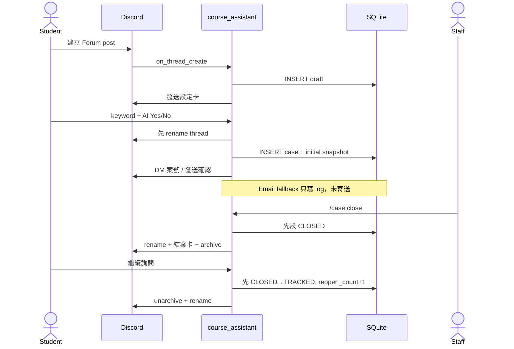
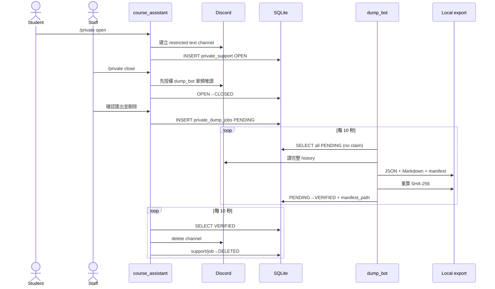

# GAS / SQLite / Drive Repository Evidence Audit

日期：2026-08-10
性質：repository 證據稽核＋本機資料層小型實作
狀態：可交給 GPT Pro 審閱，不是新的 Project Knowledge source of truth

> 證據標籤：
> **FACT** = 程式、空白 DB 或本次測試直接證明。
> **DOCUMENTED INTENT** = 文件表達的規劃。
> **INFERENCE** = 根據程式做的有限推論。
> **USER DECISION REQUIRED** = 必須保留給使用者的產品或治理決定。

---

# 十分鐘閱讀版

## 1. 目前真正已經存在什麼？

**FACT**

- Discord allowlisted 測試 Guild 的基建與兩隻 bot 在 2026-07-30 曾通過實機驗證；本次沒有連線 Discord 重新驗證。
- 真正運行的 bot 程式位於 `.local/discord-course-bots-runtime/`，不是 tracked monorepo `bots/` 原型的同一套 production path。
- live runtime 有一個可執行 SQLite initializer，實際建立 5 張表：`runtime_config`、`drafts`、`cases`、`private_support`、`private_dump_jobs`。
- Public 已有 draft、成案、案號、close、reopen 的測試切片。
- Private 已有 open → close → persistent dump job → export/checksum → verified → delete 的成功路徑。
- tracked monorepo 有版本化 JSON Schema、fixture export pipeline、去識別化、batch importer 與 GAS local scaffold。
- 本次將 GAS Sheets schema 整併為 `1.3.0`，新增本機 `CommandQueue` 與 metadata-only `EmailQueue` 契約；未套用到雲端。

## 2. 哪些只有文件或 prototype？

**FACT**

- SQLite 的 deadline、claim、lease、attempt count、retry time、outbox、Google sync state 都不存在於 live schema。
- Public 持久 batch dump queue 與 `dump_version` 自動更新尚未實作。
- 48＋48 小時自動結案的持久排程尚未實作。
- `apps/gas/` 有可 build 的 Apps Script code 與 Spreadsheet adapter，但本 repository 無雲端 deployment ID 或外部驗證證據。
- `tools/sheets_importer/FutureGoogleSheetsApiAdapter` 明確 fail closed，不會發出 Google API request。
- Drive archive folder、附件上傳與 SQLite backup 仍是文件規劃。

## 3. SQLite 現在實際保存什麼？

**FACT**

- provisioning logical key → Discord resource ID。
- Public draft metadata、原始標題、starter/setup message ID、提醒與刪除時間。
- Public case 案號、thread/author ID、module、keyword、AI 選擇、標題、status、reopen count、initial snapshot 與 `dump_version`。
- Private case 案號、channel/requester ID、AI 選擇、status 與時間。
- Private dump job 的 `PENDING`、`VERIFIED`、`DELETED` 狀態、manifest path 與時間。

SQLite 現在沒有 foreign key，也沒有 migration ledger；`PRAGMA user_version = 0`。

## 4. Public 與 Private 哪條流程比較完整？

**FACT**

Private 的「成功路徑」比 Public dump 完整，因為它已有 persistent job、checksum verify 與 verified 後刪除。但 Private 仍沒有 atomic claim/lease、bounded retry、失敗撤權或管理者通知。

Public 案件互動本身已有可用切片，但 Public dump queue 尚未存在；現在只能由管理者指定單案執行 export CLI。

## 5. GAS／Sheets／Drive 現在接通了嗎？

**FACT**

- GAS：`IMPLEMENTED LOCALLY`。
- Sheets bootstrap adapter：`IMPLEMENTED LOCALLY`，預設 fixture mode 並可 dry-run。
- 實際 Spreadsheet：`UNKNOWN`；文件說有起始 Sheet，本次未登入 Google 驗證。
- Drive adapter/archive：`DOCUMENTED ONLY`。
- Email provider：`FIXTURE／PROTOTYPE`；沒有本次外部寄信。
- clasp deployment：`DOCUMENTED ONLY`；沒有 login、push、pull 或 deploy。

## 6. 最危險的三個未完成 failure path

1. **Discord 已成功，SQLite 尚未或無法 commit；反之亦然。** close/reopen/draft delete 都可能分岔。
2. **Private job 沒有 claim/lease/retry metadata。** 雙 worker 可能重複匯出，長期失敗會每 10 秒再試。
3. **live exporter 保存 raw author identity 與 Discord attachment URL。** 這與新 Drive 規格「不保存 CDN URL」衝突，且附件 bytes 未被正式封存。

## 7. 之後需要使用者決定的事

**USER DECISION REQUIRED**

1. identity/user data 的唯一真相是 SQLite 還是 Google Sheets。
2. Case folder 在成案時或第一次 dump 時建立，以及 Week assignment 規則。
3. Email 「成功」指 provider accepted、可重試入列，還是需要更強交付證據。
4. Drive manifest 最小欄位、backup 頻率／保留期，以及 LLM 只讀去識別化資料或分層資料。

## 8. 只是工程工作、可安全交辦的事

- 將 live runtime 移入 tracked package。
- 建立 versioned SQLite migrations 與 disposable DB tests。
- 建 atomic claim/lease、bounded retry 與 outbox 測試。
- 在不改雲端的前提下產生 Sheets dry-run diff。
- 將 live exporter 收旂到 tracked contract，去除 CDN URL 與不必要 identity。

---

# 調查基線

| 項目           | 結果                                                                                                  |
| -------------- | ----------------------------------------------------------------------------------------------------- |
| Canonical root | `/Users/chamomiletea/Documents/Curricular/115-1/Calculus TA/Discord_微積分模組教學優化專案`           |
| Branch         | `codex/nap-build-20260728`                                                                            |
| HEAD           | `f155757b1f0bdc69cb0d64f7bed00d59858284d4`                                                            |
| HEAD date      | 2026-07-26 08:05:37 +0800                                                                             |
| 調查時間       | 2026-08-10（Asia/Taipei）                                                                             |
| Python         | 3.14.6                                                                                                |
| Node           | 24.13.0                                                                                               |
| npm            | 11.6.2                                                                                                |
| SQLite         | 3.51.0                                                                                                |
| Worktree       | 調查前已有大量 NAP build、Portal、provisioning 與文件的未提交變更；本次沒有清除、reset 或覆蓋這些變更 |

## 本次讀取的 Project Knowledge

1. `01_CURRENT_DECISIONS.md`
2. `03_DISCORD_CONFIG.md`
3. `02_SYSTEM_ARCHITECTURE.md`
4. `04_GAS_CLASP_PLAN.md`
5. `05_IMPLEMENTATION_STATUS_AND_ROADMAP.md`
6. `06_GOVERNANCE_AND_OPEN_QUESTIONS.md`
7. `90_DECISION_CHANGELOG.md`
8. `GAS_SQLITE_DRIVE_DATA_LAYER_BRANCH_TASK_2026-07-31.md`
9. `project-exchange/14_REV_T20-T24_Bot支線整合報告.md`
10. canonical README、Implementation Status、Next Steps 與 GAS docs

## 文件衝突

| 證據                   | 敘述                                 | 判定                                                       |
| ---------------------- | ------------------------------------ | ---------------------------------------------------------- |
| 7/29 Project Knowledge | 正式 provisioning 尚未套用           | STALE DOCUMENTATION；7/30 後已套用                         |
| 7/31 branch task       | infrastructure 完成、兩隻 bot online | 與 7/30 status 一致，但不是 8/10 即時監控                  |
| 舊 README              | Discord 尚未連接                     | STALE DOCUMENTATION；本次已更新                            |
| tracked `bots/`        | fixture-first prototype              | 不是 live runtime                                          |
| `.local/.../src`       | 實機 bot runtime                     | production path，但被 `.gitignore` 排除，HEAD 無法完整識別 |

---

# 技術詞彙翻譯

## migration

> 白話意思：讓舊資料庫可以一步一步升級到新結構。
> 在這個專案裡的用途：保證 bot 更新後不會猜測或毀損舊 SQLite。
> 程式證據：live runtime `repository.py:40-137` 目前是 inline `CREATE/ALTER`，沒有 migration ledger。

## repository

> 白話意思：把資料庫讀寫包起來的程式層。
> 在這個專案裡的用途：案件、草稿與 dump job 都透過它改變 SQLite。
> 程式證據：`.local/.../repository.py:20-407`。

## transaction

> 白話意思：一組 DB 修改要全部成功，否則全部取消。
> 在這個專案裡的用途：保護單一 SQLite 操作，但不能連同 Discord/Google API 一起 rollback。
> 程式證據：`.local/.../repository.py:32-38`。

## outbox

> 白話意思：先在 DB 留下「還有外部事情要做」的可重試收據。
> 在這個專案裡的用途：避免 SQLite 與 Discord/Google 一半成功、一半失敗後永久分岔。
> 程式證據：live schema 目前不存在 outbox。

## idempotency

> 白話意思：同一個指令重送時，不會重複建頻道、重複寄信或重複匯出。
> 在這個專案裡的用途：保護 Command/Email queue 與 Discord write。
> 程式證據：本次新增 `command-queue.schema.json`、`email-queue.schema.json`。

## claim / lease

> 白話意思：claim 是「這份工作我先處理」；lease 是會過期的暫時處理權。
> 在這個專案裡的用途：避免兩個 worker 同時匯出、寄信或執行指令。
> 程式證據：live `private_dump_jobs` 沒有這些欄位；本次新 GAS queue contracts 已要求它們。

## manifest / checksum

> 白話意思：manifest 列出匯出包應有的檔案；checksum 是驗證內容有沒有被改過的指紋。
> 在這個專案裡的用途：確認 dump JSON/Markdown 是當時驗證的 bytes。
> 程式證據：live `dump_bot/exporter.py:94-153`；tracked `tools/discord_export/pipeline.py:116-148`。

## projection

> 白話意思：為查詢而整理的精簡副本，不是完整原始資料。
> 在這個專案裡的用途：Portal 只讀案件摘要，不每次重讀全部 Discord history。
> 程式證據：`apps/gas/src/sheets/schema.ts` 的 `CaseProjection`。

## commit point / compensation

> 白話意思：commit point 是系統正式承認完成的時點；compensation 是外部步驟無法 rollback 時的補救動作。
> 在這個專案裡的用途：Discord 已建頻道但 DB 失敗時，必須可對帳、撤權或通知人工處理。
> 程式證據：現行 Public close/reopen 與 Private delete 尚無 durable compensation。

---

# Repository map

| 項目                    | Path / symbol                                                                                               | 實際責任                                              | 使用層級                                      |
| ----------------------- | ----------------------------------------------------------------------------------------------------------- | ----------------------------------------------------- | --------------------------------------------- |
| Live bot source         | `.local/discord-course-bots-runtime/src/discord_course_bots/`                                               | Discord interaction、SQLite、Private job、live export | Live test runtime；local-only                 |
| SQLite initializer      | `.local/.../repository.py::Repository._migrate`                                                             | inline CREATE/ALTER/INDEX                             | Live production path                          |
| Public service          | `.local/.../course_assistant/service.py::CourseService`                                                     | draft、case、close、reopen、title                     | Live production path                          |
| Private commands/worker | `.local/.../course_assistant/cogs.py`                                                                       | Private channel、ACL、queue、delete sweep             | Live production path                          |
| Private dump worker     | `.local/.../dump_bot/client.py::private_dump_worker`                                                        | 每 10 秒讀 PENDING、export、verify                    | Live production path                          |
| Live exporter           | `.local/.../dump_bot/exporter.py`                                                                           | JSON/Markdown/manifest，SHA-256                       | Live production path                          |
| Tracked bot core        | `bots/`                                                                                                     | ports、domain service、fixture adapters               | Prototype/fixture，不是 live runtime          |
| Versioned contracts     | `contracts/schemas/`                                                                                        | Case、message、manifest、queue 等 JSON Schema         | Tracked local contract                        |
| Local export pipeline   | `tools/discord_export/pipeline.py::DiscordExportPipeline`                                                   | atomic metadata-last export、pagination、checksum     | Implemented locally，live adapter fail closed |
| Anonymizer              | `tools/anonymizer/pipeline.py`                                                                              | 驗 manifest 後去識別化                                | Implemented locally                           |
| Sheets importer         | `tools/sheets_importer/`                                                                                    | dry-run/CSV/mock Apps Script batch                    | Implemented locally；real API absent          |
| GAS source              | `apps/gas/src/`                                                                                             | local web scaffold、Sheet bootstrap、fixture services | Implemented locally                           |
| GAS Sheet schema        | `apps/gas/src/sheets/schema.ts`                                                                             | 21 張本機 Sheet definitions                           | Local only，未 external verified              |
| Provisioning map        | `.local/.../data/discord_provisioning_resources.json` + `tools/discord_provisioning/live.py::ResourceStore` | logical key → Discord resource ID                     | Live local mapping；本報告不輸出 ID           |
| Portal contracts        | `apps/portal/` + GAS case fixture                                                                           | 只讀 fixture projection                               | Prototype/fixture                             |

---

# 實際 SQLite Schema

本次在 `/private/tmp` 以 live `Repository` 建立全新空白 DB，讀取 `sqlite_master`、`table_info`、`foreign_key_list`、`index_list`、`user_version`，隨後由 `TemporaryDirectory` 自動刪除。沒有開啟 live DB。

| Table               | Purpose from code                    | Primary key  | Important columns / constraints                                                                   | Main writers                             | Main readers                       |
| ------------------- | ------------------------------------ | ------------ | ------------------------------------------------------------------------------------------------- | ---------------------------------------- | ---------------------------------- |
| `runtime_config`    | Discord logical runtime IDs/settings | `key`        | `value NOT NULL`、`updated_at NOT NULL`                                                           | provisioner `update_runtime_config`      | `CourseService`、dump client       |
| `drafts`            | 尚未成案的 Forum post                | `thread_id`  | original title、author、starter/setup message IDs、reminded/deleted timestamps                    | `register_new_thread`、draft sweep       | `finalize_draft`、pending sweep    |
| `cases`             | Public case working state            | `case_id`    | unique case number/thread ID；AI CHECK 0/1；status TEXT；reopen default 0；dump_version default 0 | `create_case`、close/reopen/title update | `CourseService`、public export CLI |
| `private_support`   | Private case working state           | `channel_id` | unique nullable case number；AI CHECK 0/1；status TEXT                                            | private open/close/delete                | private commands、dump worker      |
| `private_dump_jobs` | Private export/delete handoff        | `channel_id` | status、requested/completed/delete times、manifest path、unused error                             | confirm dump、dump worker、delete sweep  | dump worker、delete sweep          |

## Schema-wide facts

- **FACT**：0 foreign keys。
- **FACT**：`PRAGMA user_version = 0`，沒有 migration table。
- **FACT**：唯一明確 CHECK constraints 是兩個 AI permission 0/1。status 只是 TEXT，DB 不限制 vocabulary。
- **FACT**：timestamps 是 ISO-8601 TEXT；live helper 使用 UTC offset。
- **FACT**：`private_dump_jobs.channel_id` 沒有 FK 到 `private_support`。
- **FACT**：`manifest_path` 是本機 path，沒有 Drive file/folder ID。

## 明確不存在的欄位／結構

`deadline`、`claim`、`lease`、`attempt_count`、`retry_at`、`outbox`、`archive_receipt`、`Google sync status`、`Drive file ID`、`attachment archive path`、`Public dump jobs`、版本化 migration ledger。

---

# 欄位級讀寫追蹤

| Data                     | Stored where                  | Written by                  | Read by                      | External side effect     | Failure window                                                    |
| ------------------------ | ----------------------------- | --------------------------- | ---------------------------- | ------------------------ | ----------------------------------------------------------------- |
| case ID / number         | `cases` / `private_support`   | repository create methods   | UI、exporter                 | DM 案號                  | Discord title/DM 成功與 DB create 之間可分岔                      |
| guild/channel/thread IDs | `runtime_config`、case tables | provisioner、Discord event  | services/workers             | 定位 Discord resource    | mapping 過期會找不到或操作錯誤目標                                |
| status                   | case/private/job tables       | close/reopen/workers        | UI/workers                   | archive/delete/reopen    | DB 先改後 API 失敗會分岔                                          |
| reopen_count             | `cases`                       | conditional `reopen_case`   | title、future dump selection | Discord unarchive/rename | DB 已 TRACKED 但 Discord PATCH 失敗                               |
| created_at / closed_at   | case/private tables           | repository UTC helper       | reports/workers              | 無直接                   | 沒有 server-side timestamp/default，依賴 process clock            |
| deadline                 | 不存在                        | —                           | —                            | future reminder/close    | bot 重啟無法靠 DB 補做 48＋48                                     |
| dump_version             | `cases`                       | 沒有 runtime writer         | future selection only        | Public export            | 永遠保持 0，不能當成已完成版本管理                                |
| job status               | `private_dump_jobs`           | queue/verify/delete methods | two workers                  | export/delete            | 沒有 atomic claim，雙 worker 可重複處理                           |
| claimed_by / lease       | live DB 不存在                | —                           | —                            | —                        | worker crash 後無法判斷誰持有工作                                 |
| attempt / retry          | live DB 不存在                | —                           | —                            | Discord/filesystem retry | 每 10 秒重試永久錯誤                                              |
| checksum                 | export manifest file          | exporter                    | verifier/anonymizer          | 決定是否允許後續流程     | manifest 本身沒有外部簽章，同時改 payload/manifest 不會被獨立偵測 |
| archive path             | live manifest path only       | dump worker                 | delete/review flow           | local file write         | DB VERIFIED 但 local path 之後遺失；無 Drive receipt              |
| Google sync / Drive IDs  | live DB 不存在                | —                           | —                            | future Sheets/Drive      | 目前無法對帳                                                      |

---

# Public 實際流程



**白話翻譯**

- 學生自己發文，bot 存 draft metadata。
- 成案時 Discord rename 先發生，SQLite insert 後發生。
- close/reopen 則是 SQLite 先改，Discord API 後做。
- 因此三個流程都有「外部已成功、DB 未成功」或相反的分岔窗口。
- 不可逆外部操作是刪除、封存、DM 與標題修改；現在沒有 durable outbox/compensation。
- `AUTO_CLOSED` 標題 helper 已存在，但 DB/runtime 沒有自動結案 writer，不能宣稱功能已完成。

---

# Private 實際流程



**白話翻譯**

- SQLite 真的會保存 Private job，所以 bot 重啟後仍有機會繼續。
- `dump_bot` 負責讀與驗證，`course_assistant` 才刪頻道，邊界正確。
- 最大缺口是無 claim/lease，失敗時不增 attempt、不記 retry time，也沒有 ACL rollback。
- Discord channel deletion 是不可逆外部操作；目前沒有 Drive archive receipt 作為更強的 deletion gate。

---

# Dump／Manifest／附件契約考古

## A. Live runtime contract

**FACT**：`.local/.../dump_bot/exporter.py:94-153`

Dump JSON top-level：

```text
schema_version, guild_id, channel_id, channel_name, export_scope,
case_number, exported_at, message_count, messages
```

Message shape（去識別化示意）：

```json
{
  "id": "<discord-message-id>",
  "author_id": "<discord-user-id>",
  "author_display": "<display-name>",
  "created_at": "<timestamp>",
  "edited_at": null,
  "content": "<raw-message-content>",
  "reference_message_id": null,
  "attachments": [
    {
      "id": "<attachment-id>",
      "filename": "<original-filename>",
      "content_type": "image/png",
      "size": 123,
      "url": "<temporary-discord-cdn-url>"
    }
  ]
}
```

Manifest：`schema_version`、guild/channel/scope/case/message_count 與 `files` hash map。SHA-256 覆蓋 JSON 與 Markdown 的確切 bytes，不覆蓋 manifest 自身，也不包含 attachment bytes。

**CONFLICT**：live exporter 保存 raw author ID/display name、raw content、original filename 與 Discord URL；7/31 Drive 規劃要求正式 archive 不保存 Discord CDN URL。

## B. Tracked monorepo contract

**FACT**：`tools/discord_export/pipeline.py:19-148`

- 輸出 `thread.json`、`thread.md`、`attachments.json`、`metadata.json`。
- `metadata.json` 是 metadata-last，其他三個檔案先以 temp files 完成後再 replace。
- manifest 符合 versioned `export-manifest.schema.json`，欄位是 camelCase、`files` 是 array。
- 附件契約只有 ID、filename、media type、size 與 optional SHA-256，無 CDN URL，但也不下載 bytes。
- Live 與 tracked contract 不相容：snake_case vs camelCase、file set、author projection、manifest shape 都不同。

## Duplicate / collision / dump v2 現況

- tracked pipeline 拒絕 duplicate message IDs 與 stale cursor，並可 full refresh 更新 edited message。
- 附件 filename collision 與 attachment bytes dedupe 未由 live exporter 處理。
- live export filename 依 guild/channel ID，沒有 `dump_v1` / `dump_v2` 語意。
- `cases.dump_version` 沒有 writer；因此 reopen 後的自動 v2 目前不存在。
- Public 與 Private 在 live runtime 共用 `write_export`，但 Private 多了 persistent worker/verified/delete 流程。

---

# GAS／clasp 現況

| 項目                       | 分類                   | 證據                                               |
| -------------------------- | ---------------------- | -------------------------------------------------- |
| `apps/gas/` source + build | IMPLEMENTED LOCALLY    | `npm run build --workspace @calculus/gas` 本次通過 |
| `appsscript.json`          | IMPLEMENTED LOCALLY    | V8、Asia/Taipei、webapp MYSELF                     |
| GAS health/router          | IMPLEMENTED LOCALLY    | local tests；明示 `discordGatewayHost: false`      |
| Sheets schema/bootstrap    | IMPLEMENTED LOCALLY    | `schema.ts`、`bootstrap.ts`、`gas-workbook.ts`     |
| Cloud Spreadsheet mutation | UNKNOWN / NOT EXECUTED | fixture mode 預設拒絕 `SpreadsheetApp.openById`    |
| CommandQueue               | IMPLEMENTED LOCALLY    | 本次 schema 1.3.0；沒有 consumer adapter           |
| EmailQueue                 | IMPLEMENTED LOCALLY    | 本次 metadata-only contract；沒有 MailApp adapter  |
| Email verification service | FIXTURE / PROTOTYPE    | memory provider 與 tests；無真實寄送               |
| Drive adapter/archive      | ABSENT                 | 只有 schema/docs/fixture archive index             |
| `.clasp.json`              | DOCUMENTED ONLY        | 只有 placeholder example；真實檔被 ignore          |
| clasp login/push/deploy    | NOT EXECUTED           | 本次沒有任何 Google 外部動作                       |

---

# 文件、程式與 branch task 差異矩陣

| Topic              | Branch task says                     | Project Knowledge says       | Code actually does                               | Status          |
| ------------------ | ------------------------------------ | ---------------------------- | ------------------------------------------------ | --------------- |
| SQLite 責任        | 即時狀態、jobs、retry、sync          | 分工未定                     | 只有基本 case/draft/private job                  | PARTIAL         |
| Google Sheets 責任 | Users/CaseReference/queues/Settings  | 可能是管理 projection        | 有 21-sheet 廣義 prototype                       | CONFLICT        |
| Drive archive      | dump/attachments/manifest/backup     | 規劃                         | 無 adapter                                       | NOT IMPLEMENTED |
| Public dump        | persistent queue                     | 已選方向，未實作             | 只有指定單案 CLI                                 | NOT IMPLEMENTED |
| Private dump       | persistent single-case               | 成功路徑已測                 | PENDING→VERIFIED→DELETED                         | MATCH           |
| dump version       | 每次 close 完整 snapshot             | reopen 每輪新版本            | 欄位存在但沒有 writer                            | NOT IMPLEMENTED |
| attachments        | close 時下載、SHA-256、relative path | 要白名單                     | live 只留 metadata + CDN URL                     | CONFLICT        |
| checksum           | dump/manifest                        | 要求 verify                  | JSON/Markdown SHA-256                            | PARTIAL         |
| deletion gate      | Drive/archive verify 後              | Private checksum verified 後 | local manifest VERIFIED 後刪                     | PARTIAL         |
| retries            | bounded/backoff                      | 必修                         | fixed 10-second retry                            | CONFLICT        |
| claim/lease        | 需要                                 | 需要                         | live 不存在；new GAS contracts 有欄位            | PARTIAL         |
| outbox             | SQLite sync outbox                   | 後續要求                     | 不存在                                           | NOT IMPLEMENTED |
| CaseReference      | Sheet 核心表                         | 候選                         | 只有 Cases/CaseProjection/ArchiveIndex prototype | CONFLICT        |
| CommandQueue       | 初版核心                             | 計畫                         | 本次完成 local contract/schema                   | PARTIAL         |
| EmailQueue         | 初版核心                             | 計畫                         | 本次完成 metadata-only contract/schema           | PARTIAL         |
| Settings           | logical IDs/flags/semester/version   | 計畫                         | GAS Settings + SQLite runtime_config 兩套        | PARTIAL         |
| GAS/clasp          | 後續建雲端                           | 未外部验證                   | local scaffold only                              | NOT IMPLEMENTED |
| provisioning map   | logical key → ID                     | 需保存                       | local JSON + SQLite runtime_config               | MATCH           |

---

# 本次實作

## GAS Sheets schema 1.3.0

本次沒有為同一輪的小調整保存 `1.3.0`、`1.4.0` 兩層歷史，而是將未部署的 Command/Email queue 整併成一個 migration：

```text
schema.version = 1.3.0
schema.migration.last = 0004-command-email-queues
```

### CommandQueue

- durable status
- idempotency key
- claimed worker + lease expiry
- attempt count + retry time
- target user/case references
- result/error metadata
- 契約要求 `CLAIMED` 必須有 worker 與 lease expiry

### EmailQueue

- 只保存 verified email record reference，不重複放 raw email
- 只保存 template key + opaque content reference，不保存 subject/body/verification code/credential
- status 使用 `PROVIDER_ACCEPTED`，故意不命名為 `DELIVERED`
- 契約要求 provider accepted 必須有 timestamp
- 尚未建 MailApp/GmailApp adapter，也未寄信

## 歷史與文件整理

- 更新 root README，不再錯誤宣稱 Discord 測試環境未連接。
- 更新 `docs/IMPLEMENTATION_STATUS.md`，分開 7/30 Discord live verification 與 8/10 repository/data-layer verification。
- 更新 `docs/NEXT_STEPS.md`，先受控整合 live runtime，再建 SQLite migrations/outbox。
- 更新 GAS README/Schema docs 到 1.3.0。
- 沒有複製第二份 `docs/audits` 報告；本檔是唯一完整交接報告。
- 沒有建立不必要的 SQLite schema snapshot；實際 PRAGMA 結果已收旂於本報告。
- 本次沒有刪除無法安全判定所有權的 dirty-worktree 檔案。

---

# 測試證據

| Command                                                                                                                                                                                                     | Result                                            | External service | Side effect                  |
| ----------------------------------------------------------------------------------------------------------------------------------------------------------------------------------------------------------- | ------------------------------------------------- | ---------------- | ---------------------------- |
| `PYTHONPATH=src .venv/bin/python -m pytest -q tests/test_repository.py tests/test_exporter.py tests/test_titles.py tests/test_reopen_view.py tests/test_case_numbers.py`                                    | 16 passed；28 Python 3.14/pytest-asyncio warnings | 無               | temp DB/files only           |
| `.venv/bin/python -m pytest -q tests/contract/test_json_contracts.py tests/tools/test_discord_export.py tests/tools/test_sheets_importer.py tests/bots/test_private_support.py tests/bots/test_dump_bot.py` | 64 passed                                         | 無               | temp fixture files only      |
| `npm run test --workspace @calculus/gas` baseline                                                                                                                                                           | 48 passed                                         | 無               | 無外部寫入                   |
| `npm run test --workspace @calculus/gas` after CommandQueue                                                                                                                                                 | 49 passed                                         | 無               | 無外部寫入                   |
| `npm run test --workspace @calculus/gas` after EmailQueue                                                                                                                                                   | 50 passed                                         | 無               | 無外部寫入                   |
| `.venv/bin/python -m pytest -q tests/contract/test_json_contracts.py` final contract slice                                                                                                                  | 42 passed                                         | 無               | 無                           |
| `npm run typecheck --workspace @calculus/gas`                                                                                                                                                               | passed                                            | 無               | 無                           |
| `npm run build --workspace @calculus/gas`                                                                                                                                                                   | passed                                            | 無               | ignored `dist/` build output |
| Prettier check on modified GAS/contracts                                                                                                                                                                    | passed after formatting                           | 無               | formatting only              |

注：live runtime `.venv` 的 warning path 顯示它來自舊 bootstrap 環境。這不影響本次 pass/fail，但進一步證明 live runtime 尚未完整收敛成可重現 tracked build。

---

# Failure-path coverage matrix

| Failure path                   | 已有測試？ | 實際斷言                          | 尚未覆蓋                               |
| ------------------------------ | ---------- | --------------------------------- | -------------------------------------- |
| process crash before DB commit | 部分       | SQLite transaction rollback       | Discord 已成功的對帳                   |
| process crash after DB commit  | 否         | —                                 | Discord/Google 未執行的補做            |
| Discord timeout / 429          | 否         | —                                 | retry_after、不明成功的 reconciliation |
| duplicate command              | 契約部分   | idempotency key 必填              | atomic insert/consumer 尚無            |
| expired lease                  | 契約部分   | lease 欄位必填於 CLAIMED          | reclamation worker 尚無                |
| duplicate dump request         | 部分       | Private PK + ON CONFLICT no-op    | 雙 worker 同時處理                     |
| checksum mismatch              | 有         | live/tracked verifier 拒絕 tamper | Drive receipt/signature                |
| attachment download failure    | 否         | live 根本不下載                   | resume/dedupe/cleanup                  |
| Drive upload failure           | 否         | adapter absent                    | 全部                                   |
| Discord delete failure         | 否         | 只 log + next loop retry          | ACL rollback、admin notification       |
| bot restart with pending job   | 部分       | SQLite PENDING 仍存在             | claim recovery/backoff                 |

---

# USER DECISION REQUIRED

1. **Identity authority**：SQLite 即時資料、Sheets 管理資料如何分工；哪邊能修改 user identity。
2. **Case/Week/Drive lifecycle**：Case folder 何時建立，Week 依成案、結案或匯出時間分類。
3. **Email success definition**：本次只能安全定義 `PROVIDER_ACCEPTED`；是否需要其他交付證據仍由使用者決定。
4. **Archive/privacy**：raw archive 的保留、去識別化、LLM 輸入與刪除原則。

---

# 之後該學什麼

| Topic               | Why it matters here                  | Code example to revisit                 | User depth needed    |
| ------------------- | ------------------------------------ | --------------------------------------- | -------------------- |
| SQLite transaction  | 單 DB 一致性                         | `.local/.../repository.py::transaction` | Understand concept   |
| migration           | 目前無 ledger，無法證明版本          | `Repository._migrate`                   | Review design choice |
| queue               | Private/GAS 間歇工作                 | `private_dump_jobs`、new queue schemas  | Understand concept   |
| claim/lease         | 防雙 worker                          | new contracts                           | Understand concept   |
| idempotency         | 防重複外部操作                       | queue contracts、importer               | Understand concept   |
| retry               | 不能每 10 秒永久硬撞                 | `private_dump_worker`                   | Review design choice |
| outbox              | 跨 SQLite/Discord/Google 對帳        | 目前 absent                             | Understand concept   |
| Discord API timeout | 請求 timeout 不等於失敗              | close/reopen/delete                     | Understand concept   |
| Apps Script         | 管理 API/Sheets/Email，不是 bot host | `apps/gas/`                             | Understand concept   |
| clasp               | local source 到 GAS 部署             | future runbook                          | Safe to delegate     |
| Sheets projection   | 只保存可查摘要                       | `CaseProjection`                        | Review design choice |
| Drive archive       | 完整 dump/attachment/receipt         | currently absent                        | Review design choice |
| checksum/manifest   | 驗證 bytes 未被改                    | exporters                               | Understand concept   |
| backup/restore      | SQLite 與 bot 主機綁定               | currently absent                        | Review design choice |

---

# 建議的後續順序

**RECOMMENDATION（不是新決策）**

1. 將 `.local` live runtime 受控遷入 tracked package，並以現有 16 tests 作基線。
2. 在 disposable DB 建 versioned migration ledger，先不動 live DB。
3. 新增共用 durable job/outbox schema，先做 claim/lease/retry/crash tests。
4. 收旂 live/tracked export contract，先去掉 CDN URL 與 raw display name，再設計 Drive adapter。
5. 產生目標 Spreadsheet 的 dry-run diff，人工審閱後才 apply `1.3.0`。
6. 以 fixture mail provider 做 EmailQueue consumer，完成 retry/idempotency tests 後，才用授權 service account 測試少量寄信。

---

# 自我檢查與 side effects

- 沒有讀取 `.env`、token、OAuth credential 或 `.clasprc.json`。
- 沒有讀取 live SQLite 內容。
- 沒有讀取 raw export 內容或下載附件。
- 沒有呼叫 Discord、Google Sheets、Drive 或 Email API。
- 沒有 clasp login/push/pull/deploy。
- 沒有套用 migration 到 live DB。
- 唯一 SQLite 執行是 `/private/tmp` 的空白 DB，已自動刪除。
- 有意實作只限於 tracked local GAS/contracts/docs/tests，沒有外部資料 side effect。
- 本報告不替代 Project Knowledge；GPT Pro 審查後應由主線只更新現行決策，不整包複製歷史。

## 建議 GPT Pro 優先閱讀

1. 十分鐘閱讀版
2. 實際 SQLite Schema
3. Public/Private 實際流程
4. Dump／Manifest／附件契約衝突
5. 差異矩陣
6. USER DECISION REQUIRED

---

# 完成主線後的 Portal 維護

依使用者追加授權，在資料層主線完成後做了以下本機維護；沒有部署：

- 將系統狀態頁人工快照更新至 2026-08-10，明確分開 Portal、Discord 最近人工驗證、資料層契約與外部整合狀態。
- 新增四格狀態摘要，沿用既有 tokens、語意標籤與 responsive layout。
- 修正外觀切換在瀏覽器封鎖 `localStorage` 時可能中斷的問題；儲存失敗時仍可套用當頁選擇。
- 同步 Portal README 與 design-system 文件的雙外觀、Open／Tracked／Idle／Closed 用語。
- Portal 最終驗證：43 tests passed、Astro 0 errors／0 warnings／0 hints、18 pages build、273 個 base-safe local references、Pages workflow gate 通過。
- 未連接或部署任何正式服務。
