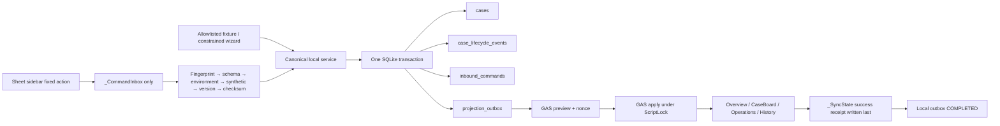

# Phase 2B Glass-box Data Bridge Report

日期：2026-08-11
分支：`codex/phase-2b-glassbox-data-bridge`
對象：專案擁有者與 GPT Pro 複核
範圍：僅 staging、synthetic-only、人工觸發、無背景排程

> **FACT**：本輪沒有讀寫真實 Google Sheet、Discord、Email 或 live SQLite。
> **FACT**：本輪使用 transport C，真實 cloud smoke 被 Gate 1 停止。
> **USER ACTION REQUIRED**：下一個唯一操作是用 Chrome `Ding Ding` 完成 compact migration 的
> dry-run → apply → second dry-run no-op，並保留 receipt。

## 十分鐘白話版

### 1. 真正資料流是什麼？

本機來源：假 fixture／wizard → canonical service → staging SQLite → projection outbox →
GAS preview/apply → `Overview` / `CaseBoard` / `Operations` / `History` → `_SyncState`。

Cloud 來源：Sheet 固定動作 → `_CommandInbox` → one-shot local fetch → 驗證 → staging
SQLite → projection outbox → Sheet receipt。

### 2. 為何 CaseBoard 不會覆寫 SQLite？

Fetcher 只讀 `_CommandInbox`。`CaseBoard`、`Overview`、`Operations`、`History` 都是人類視圖，
不在 command source allowlist。人工編輯這些 view 不會變成本機命令。

### 3. 假案件從哪裡進入？

兩個口：本機 allowlisted fixture／限制欄位的 wizard，或 Sheet sidebar 的六個固定動作。
沒有任意 SQL 或任意 JSON textarea。

### 4. SQLite 何時改變？

dry-run 不改。只在操作者提供同一計畫的 confirmation nonce，並完成全部驗證後，
apply 才在一筆 SQLite transaction 內寫 case、lifecycle event 與 projection outbox。

### 5. Cloud 何時改變？

GAS preview 零修改。只有 apply 帶同一 envelope＋nonce，通過 fingerprint、schema、
environment、synthetic-only、version 與 checksum 後才可寫。這輪因 Gate 1 關閉，實際只在
fake transport 演練，Cloud 實際修改數是 0。

### 6. checksum、version、confirmation 各在防什麼？

- checksum：防傳輸後內容被改或不完整。
- version：防舊命令倒灌與投影回滾。
- confirmation nonce：防操作者看到 A 卻套用 B。
- fingerprint：防寫到錯的 Spreadsheet。

### 7. 重複命令為何不會重複執行？

`inbound_commands` 同時約束 command ID 與 idempotency key。同 ID/key/payload/checksum 已完成時回傳
no-op；同 key 不同內容時拒絕 `COMMAND_IDEMPOTENCY_CONFLICT`。Replay 命令只記帳，不新增
lifecycle event 或 outbox。

### 8. 程式中途死亡後如何恢復？

local commit 前死亡會 rollback。claim 有 lease，過期可被另一 worker 取回，舊 token 無法 ack。
local commit 後 remote ack 前死亡，下次依 command ledger 回 no-op。GAS 要最後寫 `_SyncState`
success receipt；沒有 receipt，local outbox 不標記 completed。

### 9. 使用者在哪些地方檢查？

- CLI dry-run 的 planned transition、row counts、nonce、DB unchanged。
- `discord-data-lab summary`、`case-status`、`inspect --run-id`。
- `discord-data-bridge projection-status`、`command-status`。
- Sheet 的四個人類 view 與 `_SyncState` receipt。

### 10. 哪些仍未接到 live system？

live Bot、live SQLite、真實 Discord、Email、Drive archive、production scheduler、public endpoint 和真實
Google Sheet round-trip 都沒有連接。

## Architecture

**FACT**：SQLite 是 operational authority。Sheet 是投影與 command inbox，不是雙主寫入資料庫。

## Migration v4

新增四張表，沒有改動 v1–v3 migration bytes：

| Table | 責任 |
|---|---|
| `case_lifecycle_events` | OPEN/CLOSE/REOPEN 有意義轉移，只允許 `TST-` |
| `inbound_commands` | command ID、idempotency、version、checksum、驗證與 apply receipt |
| `projection_outbox` | atomic claim、lease、retry/backoff、completed receipt |
| `sync_state` | 兩個固定 stream 的 local/remote version 與 checksum |

**FACT**：empty DB → v4、v3 → v4、既有資料保留、重複 migration no-op、checksum/name mismatch、
unknown newer DB、transaction rollback 與 live-path refusal 都有 disposable tests。
**FACT**：真實 live DB 沒有被開啟或 migration。

## Canonical envelopes

- UTF-8，object keys lexicographic sort，compact separators。
- UTC `Z`，不允許 floating point。
- checksum 計算時排除 `checksum` 欄位本身，SHA-256 lowercase hex。
- command 只允許四個 command types 與四個 fixture refs。
- projection 只允許 `Overview`、`CaseBoard`、`Operations`、`History`。
- `Members`、`_EmailOutbox`、`_Artifacts` payload 與 Private Support 不在 Phase 2B。

## Projection rules

1. 每 batch 最多 50 筆 outbox work。
2. current-state 依 `aggregate_ref + projection_scope` 合併，只輸出最新版。
3. History append 永不合併。
4. preview bundle 寫入 Git-ignored carrier，apply 讀同一 envelope。
5. GAS 先寫人類 views，最後才寫 `_SyncState` success receipt。
6. local 收到 success receipt 後才完成 outbox claim。

## GAS functions

Standalone bundle 暴露 owner-only function wrappers：

- `standaloneBridgePreview(envelope)`
- `standaloneBridgeApply(envelope, confirmationNonce)`
- `standaloneBridgeClaimCommand(workerId)`
- `standaloneBridgeAckCommand(commandId, claimToken, resultCode)`

Bound bundle：

- `boundOpenDataLab()`
- `boundQueueDataLabCommand(action, targetCaseRef)`

Target Spreadsheet ID 與 fingerprint 只從 protected Script Properties 讀取，沒有寫入 Git、report 或 config。
Sidebar 顯示 `STAGING / SYNTHETIC ONLY`、不操作 Discord、不碰 live DB 與下一個 local CLI。

## Transport decision

**FACT — path C**：本機沒有已納管、可直接呼叫 owner-only GAS function 的 authenticated adapter；
專案也沒有 bound compact migration 三段 receipt。因此完成 local interface、GAS functions、fake
transport 與 tests 後停止，沒有改用 service account、public web app、shared secret 或解析
`.clasprc.json`。

## Experiments

### A — Local origin

- dry-run：DB 不存在時仍保持 `ABSENT`，`databaseUnchanged = true`。
- apply：建立 `TST-BASIC-001`、lifecycle `OPEN`、outbox 4 筆。
- schema summary：v4；cases +1；lifecycle +1；outbox 4。
- projection preview：Overview 2、CaseBoard 1、Operations 1、History 1；Cloud mutation 0。
- projection apply：fake transport 完成 4 筆 local outbox，真實 Cloud mutation 0。

### B — Cloud origin

**FACT**：fake integration 已演練 queue → preview → claim/lease → local transaction → ack →
projection outbox。
**DOCUMENTED INTENT**：真實 Sheet sidebar → local CLI round-trip 未執行，原因是 Gate 1 receipt 缺失。

### C — Idempotency

同 command ID/idempotency/checksum 重送回 no-op，lifecycle count 不增加。local commit 後 remote ack
失敗的測試在 lease 過期後重試，仍只有一次 lifecycle transition。Replay 命令也只記帳。

### D — Rejection

bad checksum、wrong fingerprint、wrong environment、non-synthetic、unsupported command、stale version 均在
case/outbox 改變前拒絕，只回傳 safe error code。

## Failure matrix

| Failure | 拒絕層 | SQLite | Cloud | 重試 |
|---|---|---:|---:|---|
| wrong fingerprint/schema/environment/synthetic flag | envelope validation | 不變 | 不變 | 修正目標／版本後重做 preview |
| bad checksum | canonical validation | 不變 | 不變 | 重建 envelope，不可略過 |
| stale/rollback version | sync validation | 不變 | 不變 | 不可改 version 繞過 |
| duplicate ID/key same content | inbound ledger | no-op | ack receipt | 安全 |
| same key different content | inbound ledger | 不變 | rejection receipt | 需建立新的正確命令 |
| worker dies before commit | SQLite transaction/lease | rollback | claim 過期 | 可重新 claim |
| commit succeeds, ack fails | inbound ledger | 已完成一次 | 尚未 ack | 同 command 回 no-op |
| stale claim token | queue engine/GAS claim | 不變 | 不接受 ack | 新 token 可 ack |
| partial Sheet write, no success receipt | `_SyncState` last-write gate | outbox 保留 | 可能有部分 view | 同 version/checksum 再送 |
| duplicate projection same checksum | GAS sync state | 不重複 | no-op | 安全 |
| duplicate projection different checksum | GAS sync state | outbox 保留 | 拒絕 | 需查明衝突 |
| direct edit CaseBoard/Overview | source allowlist | 忽略 | 僅 view 當下值 | 下次 projection 回歸權威狀態 |
| batch > 50 | local batching | 只處理前 50 | 只送前 50 | 下一次 one-shot 繼續 |

## Verification

Final integration gate：

- Runtime Ruff：通過。
- Runtime pytest：`70 passed`。
- GAS Vitest：`9 files / 56 tests passed`。
- GAS TypeScript typecheck：通過。
- GAS standalone/bound build：通過，所有新 wrappers 出現在 bundle。
- Secret scan：604 Git candidates，0 findings。
- `git diff --check`：通過。
- Disposable local-origin walkthrough：通過。
- 真實 cloud smoke：未執行（符合 Gate 1 停止條件）。

## Timeline

| 節點 | 時間（Asia/Taipei） | 約耗時 |
|---|---|---:|
| 任務移入 exchange、branch、baseline | 12:13 | 1 分 |
| migration v4＋contracts＋targeted tests | 12:13–12:17 | 4 分 |
| staging carrier＋ingest＋共用 queue | 12:17–12:23 | 6 分 |
| projection＋commands＋GAS＋fake integration | 12:23–12:30 | 7 分 |
| guide＋final gate＋report | 12:30–完成 | 約 8 分 |

這是 wall-clock 約數，用於紀錄這次高 reasoning 模式的工作節奏，不是 benchmark。

## Commits

1. `e7e910b` `docs(exchange): add phase 2b glassbox mission`
2. `5bcc2a5` `feat(runtime): add phase2b migration and contracts`
3. `10a549c` `feat(runtime): implement phase2b staging data lab`
4. `b6f8102` `feat(bridge): add glassbox projection and command adapters`
5. final docs commit：見本分支 HEAD。

## Main files

- Runtime：`runtime/discord-course-bots/src/discord_course_bots/data_lab/`
- Shared queue：`runtime/discord-course-bots/src/discord_course_bots/queue_engine.py`
- Migration：`runtime/discord-course-bots/src/discord_course_bots/migrations.py`
- GAS：`apps/gas/src/bridge/`、`apps/gas/src/bound.ts`、`apps/gas/src/standalone.ts`
- Tests：`runtime/discord-course-bots/tests/test_phase2b_*.py`、`apps/gas/src/bridge/*.test.ts`
- Operator guide：`docs/PHASE2B_DATA_LAB_GUIDE.md`

## Remaining blocker and NO-GO

**USER ACTION REQUIRED**：尚缺 bound compact migration 的 dry-run/apply/second dry-run no-op receipt。在 receipt
出現前，不可做真實 projection 或 command cloud smoke。

**NO-GO**：

- 不切換 live Bot，不 migration live DB。
- 不讀取真實 Discord、Email、Drive archive 或 Private Support。
- 不開 daemon、trigger、scheduler、public endpoint 或 shared secret。
- 不將姓名、學號、Discord ID、Email、訊息、附件或憑證寫入 receipt/report/Git。
- 不從人類 views 回寫 SQLite。

## GPT Pro 建議複核點

1. **RECOMMENDATION**：確認 transport C 停止點與 Gate 1 解鎖條件是否足夠明確。
2. **RECOMMENDATION**：複核 GAS 的 non-transactional partial-write 恢復語意，特別是 `_SyncState`
   last-write gate 與同 version/checksum retry。
3. **RECOMMENDATION**：複核 existing compact `_CommandInbox` 沒有獨立 `claimToken` /
   `sourceVersion` 欄位時，以 opaque `claimedBy` 與 versioned `jobRef` 承載是否可接受；若不可，
   應在下一個 schema version 正式增欄，不要在本輪偷改 v2.0.0。
4. **RECOMMENDATION**：確認真實 cloud smoke 只需最小 A（local origin）與一筆 B（cloud origin），
   且仍只使用 `TST-` / `CMD-TST-` / `SYN-`。
